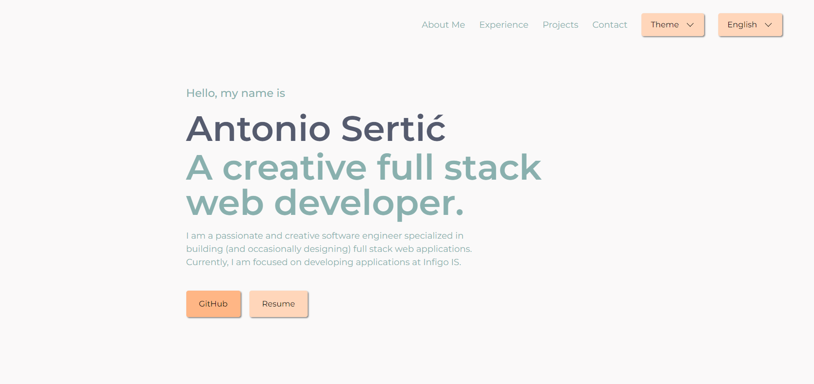

# My Portfolio Website

## Project Description

My Portfolio Website is a personal project showcasing my skills, projects, and achievements. This website is built using HTML, CSS, JavaScript, and jQuery, and it serves as a digital resume and a showcase of my work in the field of web development.

## Features

My Portfolio Website includes the following features:

1. **About Me:** A section that provides a brief introduction about me, my background, and my interests.

2. **Projects:** Display of my selected projects with descriptions, screenshots, and links to live demos or repositories.

3. **Work Experience:** Detailed information about my work history, including job roles, responsibilities, and accomplishments.

4. **Contact:** Contact information, including email and social media links, for potential employers or collaborators to reach out to me.

5. **Color Palette Selection:** Added the ability to change pre-existing color palettes to suit personal preferences.

6. **Language Selection:** Implemented a language switcher to allow users to toggle between Croatian and English translations of the page.

## Technical Details

The website was built using pure HTML, CSS, JavaScript, and jQuery. Additionally, it utilizes the Swiper library for sliders, enhancing the user experience with smooth and interactive content transitions.

This implementation incorporates modern web design techniques to ensure a responsive and visually appealing layout across various devices and screen sizes.

## Installation and Usage

To view my portfolio website locally, follow these steps:

1. Clone this repository to your computer.

2. Open the project directory.

3. Double-click the `index.html` file to open it in a web browser.
